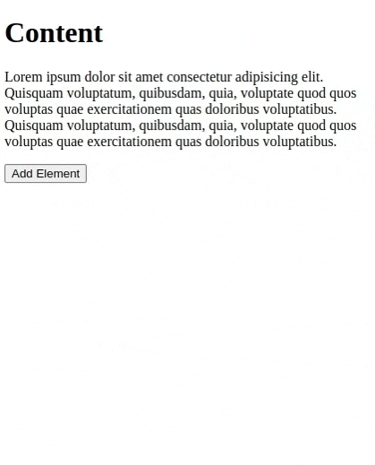
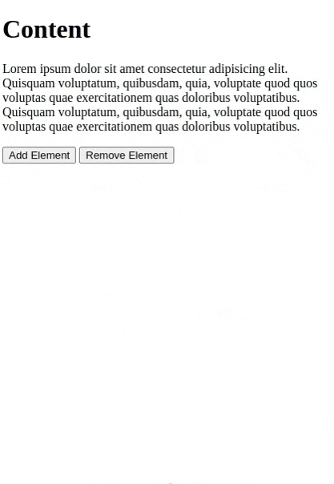

### **Exercise: Add Elements to the DOM**

#### **Objective**

Dynamically add elements to a webpage using JavaScript.

#### **Task**

1. Create a webpage with a content section containing a heading and a paragraph.
2. Below the content, add a button labeled "Add Element".
3. Every time the button is clicked, add a new paragraph to the content section.

#### **Steps**

1. Set up an HTML structure with a content `div` and a button.
2. In JavaScript, add an event listener to the button.
3. Within the event listener, dynamically create a new paragraph element.
4. Append the new paragraph to the content section.

#### **Evaluation**

Ensure that a new paragraph is added to the content section every time the button is clicked.

#### **Bonus Challenge**

Implement a "Remove Element" button to remove the last added paragraph.

#### **Screen Capture**

*Without Remove Element button*

*Or with Remove Element button*

