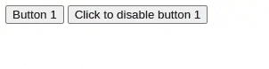

# Button Disabler

- Create an Html page
- Add two buttons
- button 1 with text "Button 1"
- button 2 with text "Click to disable button 1"
- Add a click event listener to button 2
- When button 2 is clicked, button 1 should toggle its disabled attribute on/off meaning if button 1 is disabled it should be enabled and if it is enabled it should be disabled
- Every time button 2 is clicked it's text should change to "Click to enable button 1" or "Click to disable button 1" depending on the state of button 1

## ScreenCapture

