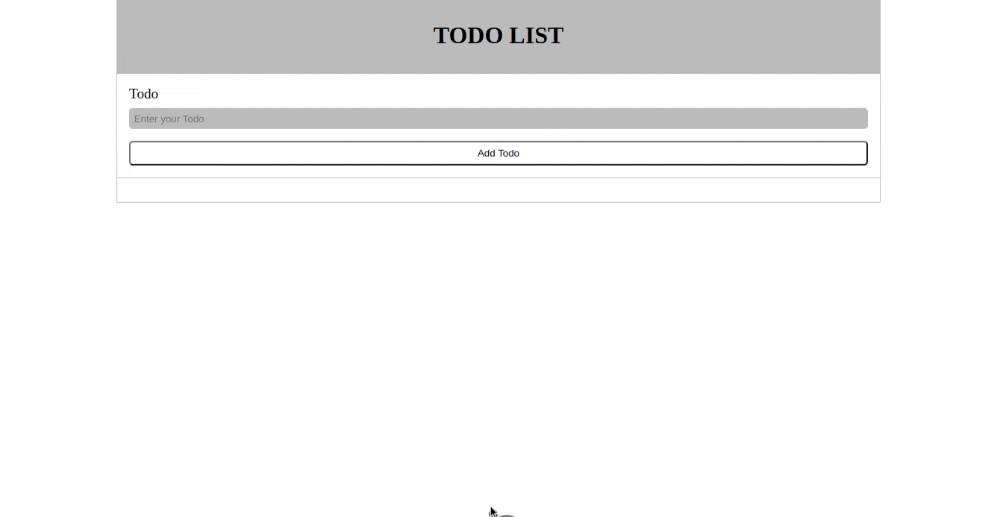
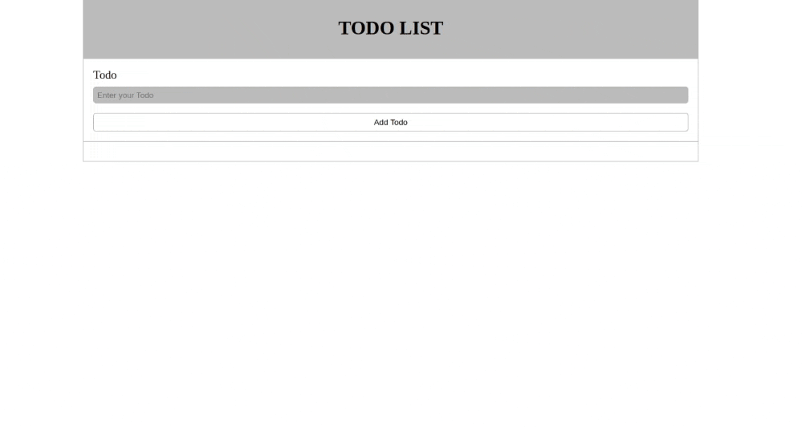

### **Exercise: Build a Basic To-Do List Interface**

#### **Objective**

Construct a clean and straightforward interface for a to-do list application.

#### **Description**

Your task is to create a simple webpage featuring a to-do list interface. The interface should include a prominent title, an input field for users to enter their tasks, and a button to add these tasks.

#### **Requirements**

1. **Title**: The page should have a title reading "TODO LIST".
2. **Input Field**: Beneath the title, include a labeled input field prompting users to "Enter your Todo".
3. **Button**: Next to the input field, add a button labeled "Add Todo".

#### **Design Guidelines**

- **Layout**: Use a centralized layout with elements aligned vertically.
- **Styling**: Apply consistent and subtle styling:
  - Use neutral colors, preferably shades of gray.
  - Employ subtle borders for input fields and buttons.
  - Ensure adequate padding and margin for all elements.

#### **Evaluation**

Open the webpage in a browser:

- It should match the provided visual in layout and styling.
- The input field and button should be interactive, though they don't need to have functionality in this exercise.

#### **Bonus Challenge**

- Add a "Delete" button next to each to-do item that removes the item when clicked.

#### **Screen Capture**

*With Bonus Challenge*

