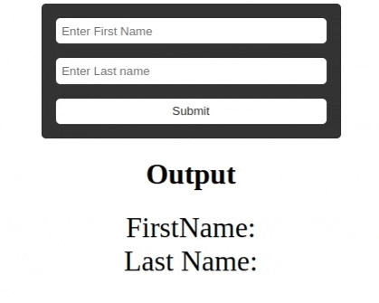

### **Dynamic Input Preview Exercise**

#### **Objective**

This exercise aims to help you understand how to capture and display user input dynamically using event listeners in JavaScript.

#### **Task**

You are given a simple HTML form that collects a user's first name and last name. Your task is to display the entered names below the form in real-time as the user types.

#### **Instructions**

1. **Form Structure**: The form contains two input fields:
   - First Name
   - Last Name

2. **Dynamic Preview**: Below the form, there's a section titled "Output". As users type into the input fields, the corresponding names should be displayed in this section.

3. **Form Submission**: When the user clicks the "Submit" button, the entered names should be finalized and displayed in the "Output" section.

4. **Bonus**: Enhance the dynamic preview. Instead of showing the names only after form submission, display them in real-time as the user types.

#### **Screen Capture**

