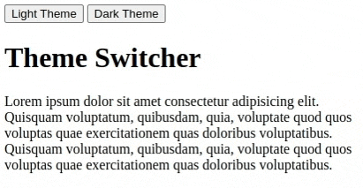
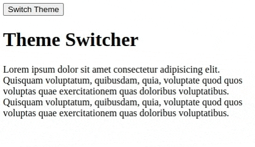

# Theme Switcher

1. Create an Html page
2. Add two buttons
3. button 1 with text "Light Theme"
4. button 2 with text "Dark Theme"
5. Add A heading with text "Theme Switcher"
6. Add a lorem ipsum paragraph
7. Add a click event listener to button 1
8. When button 1 is clicked, the background color of the page should change to white and the color of the text should change to black.
9. Add a click event listener to button 2
10. When button 2 is clicked, the background color of the page should change to black and the color of the text should change to white.

## ScreenCapture

## Bonus

Make the same page but with one button that toggles between the two themes.

## ScreenCapture

